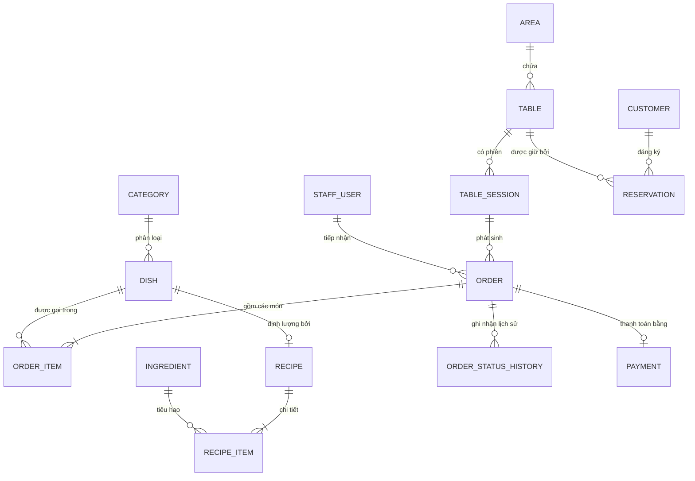

# Hương Sen – Hệ thống quản lý nhà hàng

Huong Sen Restaurant Management System là đồ án môn Lập trình Web, được xây dựng nhằm hỗ trợ tin học hóa các quy trình phục vụ và vận hành tại nhà hàng ẩm thực. Hệ thống kết nối các hoạt động chính giữa khách hàng, nhân viên phục vụ, thu ngân, nhà bếp và bộ phận quản lý trên nền tảng web thời gian thực.

---

## 1. Giới thiệu

Hương Sen là hệ thống quản lý nhà hàng phục vụ mô hình gọi món tại bàn (Dine-in) và hỗ trợ đặt món mang về/giao hàng cơ bản. Dự án được thiết kế gồm hai phần chính:

* Giao diện dành cho khách hàng: Xem thực đơn trực tuyến, tra cứu chi tiết món ăn, quét mã QR tại bàn để gọi món trực tiếp vào bếp, theo dõi tiến độ chế biến và gửi yêu cầu đặt bàn trước.
* Giao diện dành cho nhân viên và quản lý: Điểm bán hàng (POS) quản lý sơ đồ bàn, màn hình hiển thị nhà bếp (KDS) điều phối chế biến theo từng trạm, và trang quản trị (Admin Dashboard) theo dõi doanh thu, quản lý danh mục thực đơn và trạng thái nguyên liệu kho.

---

## 2. Chức năng hệ thống

Các chức năng trong hệ thống được phân chia theo từng vai trò người dùng thực tế:

### Khách hàng (Customer Portal)
* Xem trang chủ giới thiệu thông tin nhà hàng, không gian phục vụ và các món ăn đặc trưng.
* Xem thực đơn phân chia theo 15 danh mục ẩm thực truyền thống (Khai vị, Gỏi, Canh, Gà, Bò, Heo, Hải sản, Xào, Kho, Cơm, Món quê, Lẩu, Chay, Đồ uống, Tráng miệng).
* Tìm kiếm món ăn theo tên, lọc theo danh mục, lọc theo mức độ cay (Không cay, Cay nhẹ, Cay vừa, Cay nồng) và sắp xếp theo giá hoặc độ bán chạy.
* Xem chi tiết món ăn: hình ảnh, mô tả, khẩu phần, lượng calo ước tính, thành phần nguyên liệu, cảnh báo dị ứng và thời gian nấu định mức.
* Chọn các tùy chọn món (size phần ăn, mức cay, ăn kèm, topping) và thêm vào giỏ hàng.
* Gọi món tại bàn bằng mã QR (`/table/:qrToken`): Tự động nhận diện số bàn và khu vực, gửi đơn món trực tiếp vào bếp mà không cần gọi nhân viên ghi giấy.
* Theo dõi tiến độ chế biến món ăn theo thời gian thực (Chờ tiếp nhận -> Đang nấu trên bếp -> Nấu xong -> Đã phục vụ ra bàn).
* Gửi yêu cầu tính tiền tại bàn trực tiếp từ điện thoại tới quầy thu ngân.
* Đặt bàn trước (`/reserve`): Điền ngày giờ, số lượng khách, chọn khu vực bàn mong muốn và ghi chú yêu cầu tiệc.
* Tra cứu thông tin đơn hàng (`/order-lookup`) bằng mã đơn hoặc số điện thoại người đặt.
* Xem các đánh giá nhận xét từ thực khách đã dùng bữa (chỉ hiển thị nhãn đã xác thực cho đơn hàng hoàn tất).

### Nhân viên thu ngân & phục vụ (POS)
* Sơ đồ bàn trực quan theo 3 khu vực không gian: Sảnh Mộc (Tầng Trệt), Hiên Sen và Phòng VIP.
* Hiển thị trạng thái bàn bằng màu sắc: Xanh lá (Bàn trống), Đỏ (Đang có khách), Vàng (Đã đặt trước), Xám (Đang dọn dẹp vệ sinh).
* Mở bàn mới, chọn món trực tiếp trên POS và gửi đơn vào bếp (hỗ trợ nhiều đợt gọi món khác nhau trong cùng một phiên ăn).
* Chuyển vị trí bàn ăn khi khách hàng có yêu cầu chuyển chỗ.
* Nhận tín hiệu chuông cảnh báo và thông báo khi có bàn ăn nhấn nút gọi thanh toán từ xa.
* Xử lý thanh toán hóa đơn: Tiền mặt (tính tiền thừa), Thẻ ngân hàng, hoặc Chuyển khoản (sinh mã QR thanh toán động mô phỏng VietQR).
* Nhập mã giảm giá khuyến mãi (Coupon) hợp lệ theo cấu hình từ hệ thống.
* Đóng phiên ăn của bàn và tự động chuyển trạng thái bàn sang "Đang dọn dẹp" (cleaning).

### Nhà bếp & Quầy bar (KDS)
* Phân chia hàng đợi món theo 5 trạm chế biến chuyên trách: Bếp Nóng & Chiên Xào, Bếp Lạnh & Khai Vị, Bếp Nướng & Món Kho, Bếp Canh & Lẩu, Quầy Pha Chế & Tráng Miệng.
* Hiển thị chi tiết từng món ăn: Tên món, số lượng, tùy chọn đi kèm, ghi chú đặc biệt từ khách hàng, số bàn và đợt gọi món.
* Đồng hồ đo thời gian làm món: Đếm phút từ khi nhận order để đầu bếp kiểm soát tốc độ phục vụ.
* Chuyển trạng thái chế biến 1 chạm: Đang chờ -> Bắt đầu nấu -> Nấu xong (sẵn sàng mang ra bàn) -> Đã phục vụ.
* Nhận âm thanh chuông báo tự động mỗi khi có món mới được gửi vào bếp qua WebSocket.

### Quản trị viên (Admin Dashboard)
* Thống kê kinh doanh hôm nay: Doanh thu thực tế (tính từ các đơn đã thanh toán thành công), số lượt gọi món, số bàn đang phục vụ, tỷ lệ lấp đầy bàn ăn và tốc độ làm món trung bình của bếp.
* Biểu đồ doanh thu hôm nay phân bổ theo các khung giờ phục vụ trong ngày (10:00, 12:00, 14:00, 16:00, 18:00, 20:00, 22:00).
* Thống kê Top 5 món bán chạy nhất dựa trên sản lượng và doanh thu tổng hợp từ bảng chi tiết đơn hàng (`OrderItem`).
* Danh sách các đơn hàng gần đây với mã đơn, bàn phục vụ, tổng tiền và trạng thái hiện tại.
* Quản lý thực đơn: Xem danh mục, thêm mới danh mục món, bật/tắt trạng thái món ăn (khóa món/báo hết món 86 để đồng bộ ngay lập tức tới Menu và POS).
* Quản lý danh sách đặt bàn: Tiếp nhận thông tin khách đặt trước, xác nhận đặt bàn hoặc chuyển bàn khi khách đến.
* Quản lý kho nguyên vật liệu: Theo dõi danh sách nguyên liệu, lượng tồn thực tế, giá vốn nhập và cảnh báo các mặt hàng chạm ngưỡng tồn an toàn (`minStock`).

---

## 3. Công nghệ sử dụng

| Phân loại | Công nghệ / Thư viện | Phiên bản | Mục đích sử dụng |
| :--- | :--- | :--- | :--- |
| **Frontend Framework** | React | 19.2 | Xây dựng giao diện người dùng theo component |
| **Build Tool** | Vite | 8.3 | Đóng gói và chạy môi trường phát triển frontend |
| **Ngôn ngữ lập trình** | TypeScript | 5.8 (Backend) / 6.0 (Frontend) | Đảm bảo tính chặt chẽ về kiểu dữ liệu (Type Safety) |
| **Styling** | Tailwind CSS | 3.4 | Xây dựng giao diện và tiện ích bố cục |
| **Routing** | React Router DOM | 7.18 | Điều hướng các trang trong ứng dụng Single Page App |
| **HTTP Client** | Axios | 1.20 | Giao tiếp với các API RESTful của Backend |
| **Biểu đồ** | Recharts | 3.10 | Vẽ biểu đồ doanh thu và món bán chạy trên Dashboard |
| **Giao diện & Icon** | Lucide React | 1.48 | Bộ biểu tượng giao diện người dùng |
| **Backend Runtime** | Node.js + Express | Express 4.21 | Xây dựng máy chủ API và xử lý nghiệp vụ hệ thống |
| **Database** | SQLite (`dev.db`) | 3 | Lưu trữ dữ liệu quan hệ cho đồ án |
| **ORM** | Prisma ORM | 6.4 / 6.19 | Quản lý schema, sinh migration và truy vấn CSDL |
| **Giao tiếp Real-time** | Socket.io | 4.8 | Đồng bộ trạng thái tức thời giữa POS, KDS và Client |
| **Xác thực (Auth)** | JSON Web Token (JWT) + bcryptjs | JWT 9.0 / bcryptjs 3.0 | Xác thực phiên đăng nhập và băm mật khẩu tài khoản |
| **Bảo mật cơ bản** | Helmet + express-rate-limit + CORS | Helmet 8.3 / Rate-limit 8.7 | Chống tấn công brute-force và bảo vệ HTTP headers |

---

## 4. Cấu trúc project

```
LTW/
├── backend/
│   ├── prisma/
│   │   ├── data/                 # Dữ liệu mẫu 118 món ăn và đánh giá thực khách
│   │   ├── dev.db                # File cơ sở dữ liệu SQLite
│   │   ├── schema.prisma         # Định nghĩa schema 24 bảng dữ liệu Prisma
│   │   ├── seed.ts               # Script chính thực hiện nạp dữ liệu mẫu
│   │   ├── seed_base.ts          # Nạp hạ tầng: chi nhánh, vai trò, nhân sự, bàn, danh mục
│   │   ├── seed_dishes.ts        # Nạp 118 món ăn và liên kết nhóm tùy chọn
│   │   ├── seed_inventory.ts     # Nạp kho nguyên vật liệu và công thức định lượng
│   │   └── seed_orders.ts        # Nạp lịch sử đơn hàng, phiên bàn và đặt bàn
│   ├── src/
│   │   ├── config/               # Cấu hình kết nối Prisma Client
│   │   ├── middlewares/          # Middleware xác thực JWT và phân quyền vai trò (Role)
│   │   ├── modules/
│   │   │   ├── audit/            # Module ghi nhật ký kiểm toán thao tác hệ thống
│   │   │   ├── auth/             # Module đăng ký, đăng nhập nhân viên và khách hàng
│   │   │   ├── dashboard/        # Module tổng hợp báo cáo kinh doanh từ CSDL
│   │   │   ├── inventory/        # Module quản lý nguyên vật liệu và biến động kho
│   │   │   ├── kds/              # Module điều phối và theo dõi trạng thái bếp
│   │   │   ├── menu/             # Module quản lý danh mục, món ăn và đánh giá
│   │   │   ├── orders/           # Module tạo đơn, máy trạng thái đơn hàng và chuyển bàn
│   │   │   ├── payments/         # Module xử lý thanh toán và đóng phiên bàn
│   │   │   ├── reports/          # API báo cáo tương thích cho dashboard
│   │   │   ├── reservations/     # Module đặt bàn trước và kiểm tra xung đột giờ
│   │   │   └── tables/           # Module sơ đồ bàn, mã QR và phiên dùng bữa
│   │   ├── sockets/              # Khởi tạo Socket.io server và danh sách sự kiện
│   │   ├── app.ts                # Thiết lập Express, middleware bảo mật và mount routes
│   │   └── server.ts             # Entry point khởi chạy HTTP server và Socket.io
│   ├── .env                      # File cấu hình biến môi trường backend
│   ├── .env.example              # Mẫu cấu hình môi trường backend
│   ├── package.json
│   └── tsconfig.json
│
├── frontend/
│   ├── src/
│   │   ├── components/           # Navbar, CartDrawer, ProtectedRoute, Charts
│   │   ├── contexts/             # AuthContext (quản lý đăng nhập), CartContext (giỏ hàng)
│   │   ├── pages/
│   │   │   ├── admin/            # AdminPage (Dashboard báo cáo, quản lý món, đơn hàng, đặt bàn)
│   │   │   ├── auth/             # LoginPage (Đăng nhập nhân viên nội bộ và khách hàng)
│   │   │   ├── customer/         # HomePage, MenuPage, ReservationPage, TableOrderPage, OrderLookupPage
│   │   │   ├── kds/              # KdsPage (Màn hình điều phối bếp hiển thị theo trạm)
│   │   │   └── pos/              # PosPage (Sơ đồ bàn, tạo đơn tại bàn, thanh toán hóa đơn)
│   │   ├── services/             # Axios client cấu hình sẵn baseUrl và socket client
│   │   ├── App.tsx               # Khai báo cây điều hướng (Router) toàn bộ ứng dụng
│   │   ├── main.tsx              # Khởi tạo React DOM và nạp CSS
│   │   └── index.css             # Tailwind directives và kiểu dáng tùy biến
│   ├── .env.example              # Mẫu cấu hình môi trường frontend
│   ├── index.html
│   ├── package.json
│   ├── tailwind.config.js
│   ├── tsconfig.json
│   └── vite.config.ts
│
├── .gitignore
└── README.md
```

---

## 5. Cơ sở dữ liệu

Project sử dụng cơ sở dữ liệu SQLite thông qua Prisma ORM. Schema gồm 24 mô hình bảng liên kết:

1. **Nhóm người dùng & phân quyền**: `Role` (admin, manager, cashier, waiter, chef), `StaffUser` (nhân sự nội bộ), `Customer` (khách hàng thành viên).
2. **Nhóm chi nhánh & không gian**: `Branch` (chi nhánh Hương Sen), `Area` (3 khu vực), `Table` (22 bàn ăn có mã QR cố định), `TableSession` (phiên dùng bữa của bàn).
3. **Nhóm thực đơn & tùy chọn**: `KitchenStation` (5 trạm bếp), `Category` (15 danh mục), `Dish` (118 món ăn kèm giá bán và giá vốn), `ModifierGroup`, `ModifierItem`, `DishModifierGroup`.
4. **Nhóm kho & định lượng**: `Ingredient` (24 nguyên vật liệu), `InventoryTransaction` (thẻ kho nhập, xuất, hao hụt), `Recipe`, `RecipeItem` (định lượng cho từng phần ăn).
5. **Nhóm đơn hàng & bếp**: `Order` (đơn hàng lưu trạng thái và tổng tiền), `OrderStatusHistory` (lịch sử chuyển trạng thái), `OrderItem` (chi tiết món lưu snapshot tên món và giá lúc đặt), `OrderItemModifier`, `KitchenTicket`.
6. **Nhóm thanh toán & khuyến mãi**: `Payment` (hóa đơn thanh toán), `PaymentTransaction`, `Promotion` (mã giảm giá), `PromotionUsage`.
7. **Nhóm tiện ích mở rộng**: `Reservation` (lịch đặt bàn trước), `Review` (đánh giá món ăn có xác thực đơn hàng), `AuditLog` (nhật ký kiểm toán thao tác hệ thống).

### Sơ đồ quan hệ thực thể cốt lõi



---

## 6. Luồng hoạt động chính

### 6.1. Luồng gọi món tại bàn bằng QR Code
```
Khách quét mã QR tại bàn (/table/:qrToken)
      ↓
Frontend gửi mã QR lên API để định danh bàn ăn và khu vực
      ↓
Khách chọn món, thêm tùy chọn (size, vị cay, món kèm) vào giỏ
      ↓
Khách nhấn "Gửi Vào Bếp Nấu"
      ↓
Backend mở transaction:
- Mở hoặc gán vào TableSession hiện tại
- Kiểm tra đơn giá từ CSDL và lưu snapshot vào OrderItem
- Tạo OrderStatusHistory (trạng thái: preparing)
- Tự động trừ kho nguyên liệu theo định lượng Recipe (nếu có cấu hình)
      ↓
Backend phát sự kiện "order_items_added" qua Socket.io
      ↓
Màn hình Bếp (KDS) nhận thông báo âm thanh và hiển thị thẻ món vào hàng đợi
      ↓
Đầu bếp thao tác: Bắt đầu nấu -> Nấu xong -> Đã phục vụ
      ↓
Khách hàng và Thu ngân (POS) thấy trạng thái cập nhật tức thời
```

### 6.2. Luồng thanh toán hóa đơn
```
Khách nhấn "Gọi tính tiền" trên trang QR (hoặc yêu cầu trực tiếp)
      ↓
Thu ngân nhận chuông cảnh báo trên màn hình POS (/pos)
      ↓
Thu ngân mở chi tiết bàn ăn, đối soát danh sách món và áp dụng khuyến mãi
      ↓
Chọn hình thức thanh toán (Tiền mặt / Thẻ / Chuyển khoản VietQR mô phỏng)
      ↓
Thu ngân bấm "Thanh toán & In hóa đơn"
      ↓
Backend thực thi transaction:
- Tạo bản ghi Payment và PaymentTransaction
- Chuyển trạng thái Order sang 'completed' và 'paid'
- Đóng TableSession (isActive = false, status = 'closed')
- Đổi trạng thái Table sang 'cleaning' (chờ dọn dẹp)
      ↓
Backend phát sự kiện "payment_completed" và "table_status_changed"
      ↓
Sơ đồ bàn trên POS đổi sang màu xám; Dashboard ghi nhận thêm doanh thu thực
```

### 6.3. Hoạt động của Socket.io
Socket.io được sử dụng để đồng bộ trạng thái giữa các màn hình mà không cần tải lại trang. Các sự kiện chính bao gồm:
* `table_status_changed`: Cập nhật trạng thái bàn (trống, đang có khách, chờ dọn) giữa POS và trang Admin.
* `order_created` / `order_items_added`: Báo có order món mới gửi tới màn hình KDS và POS.
* `kds_item_updated`: Báo cập nhật tiến độ nấu từng món (đang nấu, đã xong, đã mang ra) tới giao diện khách và POS.
* `bill_requested`: Phát chuông báo thu ngân khi khách hàng bấm nút gọi tính tiền từ bàn.
* `payment_completed`: Báo hoàn tất thanh toán hóa đơn để giải phóng bàn.
* `dish_availability_changed`: Thông báo khi quản trị viên khóa món hoặc mở bán lại món ăn.

---

## 7. Hướng dẫn cài đặt và khởi chạy

### Yêu cầu môi trường
* Node.js phiên bản 18 trở lên (khuyến nghị Node 20 hoặc 22).
* Trình quản lý gói npm đi kèm Node.js.

### Bước 1: Clone mã nguồn
```bash
git clone https://github.com/Duy2025-1/huong-sen-restaurant.git
cd huong-sen-restaurant
```

### Bước 2: Cài đặt và khởi động Backend
Mở một cửa sổ dòng lệnh tại thư mục gốc của project:
```bash
cd backend
npm install

# Đồng bộ schema vào cơ sở dữ liệu SQLite
npm run prisma:migrate

# Nạp dữ liệu mẫu ban đầu (Hạ tầng, Thực đơn 118 món, Kho, Đơn mẫu)
npm run prisma:seed

# Khởi chạy server backend ở chế độ phát triển
npm run dev
```
Backend sẽ khởi chạy tại địa chỉ: `http://localhost:5000` (kèm cổng kết nối WebSocket).

### Bước 3: Cài đặt và khởi động Frontend
Mở một cửa sổ dòng lệnh thứ hai:
```bash
cd frontend
npm install

# Khởi chạy frontend ở chế độ phát triển
npm run dev
```
Frontend sẽ khởi chạy tại địa chỉ: `http://localhost:5173`.

---

## 8. Cấu hình biến môi trường

### Backend (`backend/.env`)
Tham khảo file mẫu tại `backend/.env.example`:
```ini
PORT=5000
DATABASE_URL="file:./dev.db"
JWT_SECRET="replace_with_a_secure_random_32_character_secret_key"
CLIENT_URL="http://localhost:5173"
NODE_ENV="development"
```

### Frontend (`frontend/.env`)
Tham khảo file mẫu tại `frontend/.env.example`:
```ini
VITE_API_URL=http://localhost:5000/api
VITE_SOCKET_URL=http://localhost:5000
```

---

## 9. Tài khoản demo

Cơ sở dữ liệu được nạp sẵn 4 tài khoản nhân viên nội bộ phục vụ việc chấm điểm và kiểm thử đồ án:

| Vai trò | Email đăng nhập | Mật khẩu | Phạm vi truy cập |
| :--- | :--- | :--- | :--- |
| **Quản trị viên (Admin)** | `admin@rms.com` | `123456` | Toàn quyền: Xem Dashboard doanh thu, quản trị thực đơn, duyệt đặt bàn, quản lý kho |
| **Thu ngân (Cashier)** | `cashier@rms.com` | `123456` | Màn hình POS: Mở bàn, gọi thêm món, áp voucher, thanh toán và in hóa đơn |
| **Bếp trưởng (Chef)** | `chef@rms.com` | `123456` | Màn hình bếp KDS: Xem danh sách món theo trạm, chuyển trạng thái nấu, báo hoàn tất |
| **Nhân viên phục vụ (Waiter)** | `waiter@rms.com` | `123456` | Màn hình POS: Mở phiên bàn, hỗ trợ khách gọi món, chuyển bàn ăn |

*Lưu ý: Trang đăng nhập `/login` có tích hợp sẵn 4 nút bấm điền nhanh tài khoản demo để thuận tiện cho việc trình bày.*

---

## 10. Các route chính trên Frontend

| Đường dẫn (URL) | Phân hệ | Đối tượng | Mô tả chức năng |
| :--- | :--- | :--- | :--- |
| `/` | Khách hàng | Công khai | Trang chủ giới thiệu nhà hàng Hương Sen, không gian và món ăn tiêu biểu |
| `/menu` | Khách hàng | Công khai | Thực đơn 15 danh mục, tìm kiếm, bộ lọc món, modal chi tiết và giỏ hàng |
| `/table/:qrToken` | Khách hàng | Khách tại bàn | Giao diện gọi món theo bàn sau khi quét mã QR dán tại bàn ăn |
| `/reserve` | Khách hàng | Công khai | Giao diện đăng ký đặt bàn trước theo ngày giờ và số khách |
| `/order-lookup` | Khách hàng | Công khai | Tra cứu tiến độ đơn hàng bằng mã đơn hoặc số điện thoại |
| `/login` | Xác thực | Chung | Đăng nhập tài khoản nhân viên nội bộ và tài khoản khách hàng |
| `/pos` | Vận hành | Nhân viên (Admin/Cashier/Waiter) | Sơ đồ bàn theo khu vực, mở bàn, chọn món, thanh toán hóa đơn |
| `/kds` | Vận hành | Nhà bếp (Admin/Chef) | Màn hình hiển thị bếp KDS phân chia theo 5 trạm chế biến |
| `/admin` | Quản trị | Quản lý (Admin/Manager) | Bảng điều khiển doanh thu từ CSDL, quản lý món ăn, đặt bàn và kho |

---

## 11. Các nhóm API chính

Hệ thống backend cung cấp RESTful API với các tiền tố chính:

* `/api/auth`: Đăng ký, đăng nhập nhân viên/khách hàng, lấy thông tin phiên làm việc hiện tại (`GET /me`).
* `/api/tables`: Lấy danh sách bàn theo khu vực, tra cứu bàn theo mã QR token, mở phiên bàn mới, chuyển trạng thái bàn.
* `/api/menu`: Lấy toàn bộ thực đơn kèm danh mục và tùy chọn, lọc món theo điều kiện, thêm/sửa/xóa món ăn, bật/tắt trạng thái khóa món (86).
* `/api/orders`: Tạo đơn gọi món tại bàn (kèm mã idempotency chống trùng), tạo đơn mang về, cập nhật trạng thái đơn hàng theo máy trạng thái, tra cứu đơn hàng.
* `/api/kds`: Lấy danh sách món ăn đang chờ làm theo trạm bếp, cập nhật trạng thái nấu (`cooking`, `ready`, `served`).
* `/api/payments`: Xử lý thanh toán hóa đơn, xác minh mã giảm giá, đóng phiên bàn, sinh mã chuyển khoản mô phỏng VietQR.
* `/api/reservations`: Tiếp nhận yêu cầu đặt bàn, kiểm tra xung đột trùng bàn trong khung giờ $\pm 2$ tiếng, duyệt trạng thái đặt bàn.
* `/api/dashboard`: Tổng hợp số liệu kinh doanh hôm nay từ CSDL (doanh thu, lượt đơn, tỷ lệ bàn, tốc độ KDS, phân bổ doanh thu theo giờ, top món bán chạy).
* `/api/inventory`: Lấy danh sách 24 nguyên vật liệu kho, cảnh báo các mặt hàng sắp hết, ghi nhận giao dịch nhập/xuất kho.

---

## 12. Kịch bản chạy thử nhanh (Demo)

Để kiểm tra luồng hoạt động đồng bộ giữa các màn hình, có thể thực hiện theo các bước sau:

1. **Đăng nhập nhân viên**:
   * Truy cập `http://localhost:5173/login`, bấm chọn nút đăng nhập nhanh **Thu ngân (Cashier)**.
2. **Khách hàng gọi món tại bàn**:
   * Mở một tab trình duyệt ẩn danh (hoặc tab riêng): truy cập link bàn mẫu `http://localhost:5173/table/B01-HS3E8`.
   * Chọn món *Chả Giò Hương Sen Tôm Cua* (số lượng: 1), chọn tùy chọn và nhấn **"Gửi Vào Bếp Nấu"**.
3. **Bếp nhận món và chế biến trên KDS**:
   * Mở thêm một tab: truy cập `http://localhost:5173/kds` (hoặc đăng nhập tài khoản Chef).
   * Món ăn vừa đặt xuất hiện ở trạm bếp kèm chuông thông báo. Bấm **"Bắt đầu nấu"** -> Bấm **"Nấu xong"** -> Bấm **"Đã phục vụ"**.
   * Quan sát tab khách hàng: trạng thái món chuyển màu tương ứng mà không cần tải lại trang.
4. **Gọi tính tiền và thanh toán tại POS**:
   * Tại tab khách hàng, bấm nút **"Gọi thanh toán"**.
   * Chuyển sang màn hình POS `http://localhost:5173/pos`: Bàn B01 hiển thị chuông gọi tính tiền.
   * Thu ngân nhấn vào Bàn B01, chọn **"Thanh toán"**, chọn phương thức Tiền mặt hoặc Chuyển khoản VietQR và xác nhận.
   * Bàn B01 tự động chuyển sang màu xám ("Đang dọn dẹp").
5. **Kiểm tra số liệu Dashboard**:
   * Truy cập `http://localhost:5173/admin` bằng tài khoản Admin (`admin@rms.com` / `123456`).
   * Xem doanh thu hôm nay và danh sách đơn hàng vừa hoàn tất được tính toán trực tiếp từ cơ sở dữ liệu.

---

## 13. Dữ liệu mẫu (Seed Data)

Cơ sở dữ liệu của project có sẵn dữ liệu mẫu phục vụ quá trình chạy thử và chấm điểm đồ án:
* 1 chi nhánh: Nhà Hàng Ẩm Thực Hương Sen (18 Đường Hoa Sen, Bến Nghé, Quận 1, TP. Hồ Chí Minh).
* 22 bàn ăn chia theo 3 khu vực: Sảnh Mộc (B01 - B10), Hiên Sen (H01 - H06) và Phòng VIP (VIP-01 - VIP-06).
* 15 danh mục và 118 món ăn Việt Nam có đầy đủ hình ảnh, mô tả, đơn giá, định lượng calo và nhóm tùy chọn ăn kèm.
* 24 nguyên liệu thực phẩm trong kho và công thức định lượng (Recipe) cho các món chính.
* Lịch sử đơn hàng trong 6 ngày gần nhất và các đơn hàng hoàn tất trong ngày hôm nay theo các khung giờ phục vụ để kiểm thử biểu đồ và top món bán chạy.
* Một số bàn mẫu ở các trạng thái khác nhau tại thời điểm hiện tại: Bàn B01 (đang nấu), Bàn B02 (đã phục vụ, chờ tính tiền), Bàn B04 (chờ dọn dẹp), Bàn VIP-01 (đã đặt trước tối nay).

---

## 14. Giới hạn hiện tại của đồ án

* **Thanh toán trực tuyến ở mức mô phỏng**: Chức năng quét mã VietQR hiện sinh mã QR theo định dạng chuyển khoản mẫu (chưa kết nối webhook với cổng thanh toán hoặc ngân hàng thực tế để tự động nhận tiền vào tài khoản).
* **Chưa kết nối máy in hóa đơn vật lý**: Hóa đơn thanh toán được hiển thị dưới dạng bản in xem trước (Print Preview) trên trình duyệt web, chưa xuất lệnh in trực tiếp qua cổng ESC/POS hoặc Bluetooth.
* **Giao diện di động**: Hệ thống xây dựng dưới dạng Web Responsive (thích ứng kích thước màn hình), chưa đóng gói thành ứng dụng di động độc lập (Android/iOS).
* **Cơ sở dữ liệu**: Đang cấu hình chạy trên SQLite cục bộ nhằm thuận tiện khi nộp bài và chạy thử trên một máy duy nhất; chưa cấu hình clustering cho môi trường tải lớn.
* **Dịch vụ giao hàng**: Đơn giao hàng (Delivery) chỉ ghi nhận địa chỉ và số điện thoại trên hệ thống nội bộ, chưa tích hợp API của các đơn vị vận chuyển bên ngoài.

---

## 15. Hướng phát triển tiếp theo

* Tích hợp cổng thanh toán trực tuyến thực tế (cổng VNPay Sandbox hoặc Open API ngân hàng kiểm tra biến động số dư).
* Hỗ trợ giao tiếp trực tiếp với máy in hóa đơn nhiệt qua giao thức mạng LAN hoặc Web Bluetooth.
* Bổ sung tính năng chấm công và quản lý ca làm việc chi tiết cho từng nhân viên.
* Mở rộng phân hệ quản lý kho: hỗ trợ tạo phiếu nhập kho từ nhà cung cấp, quét mã vạch và kiểm kê thực tế theo định kỳ.
* Xây dựng ứng dụng di động dành riêng cho nhân viên phục vụ (Waiter App) để thao tác nhanh tại bàn.
* Đóng gói Docker Container (Dockerfile, docker-compose) và triển khai hệ thống lên máy chủ VPS.

---

## 16. Thông tin đồ án

* **Tên đề tài**: Hệ thống quản lý và vận hành nhà hàng Hương Sen (Huong Sen RMS)
* **Môn học**: Lập trình Web
* **Nhóm sinh viên thực hiện**: [Bổ sung tên nhóm / thành viên]
* **Giảng viên hướng dẫn**: [Bổ sung tên giảng viên]
* **Trường**: Trường Đại Học GTVT TPHCM
* **Năm học**: 2025 - 2026
